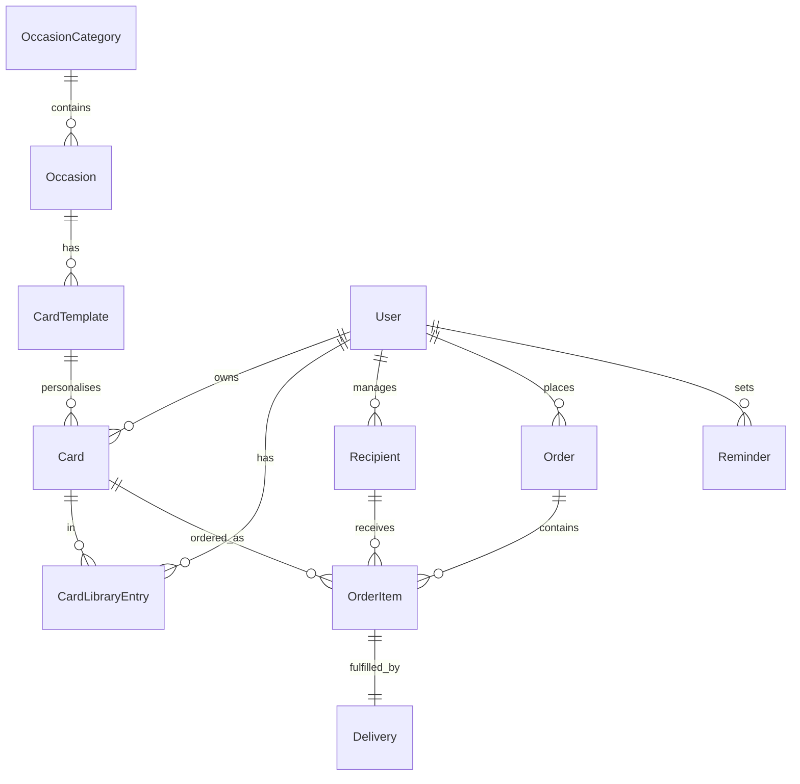

# Architecture

## Package structure

```
src/piggyback/
├── models/           # Data models (catalog, cards, orders, etc.)
├── api/              # DRF serializers, viewsets, URLs
├── views/            # Django template views
├── services/         # Business logic (delivery, checkout, rendering)
├── templates/        # HTML templates + HTMX partials
├── static/           # CSS, JS (editor + Fabric.js)
├── management/       # Management commands
├── templatetags/     # Template filters
├── admin.py          # Django admin
├── signals.py        # Library auto-sync
└── urls.py           # URL routing
```

## Data model relationships



## Design principles

- **Pluggable delivery** — Swap email/postal backends via settings
- **Headless-ready** — Full REST API alongside web UI
- **HTMX + Alpine** — Progressive enhancement without a SPA build step
- **Signal-driven library** — Card library stays in sync automatically
- **JSON canvas storage** — Editor state stored as portable Fabric.js JSON

## Extension points

| Extension | How |
|-----------|-----|
| Payment provider | Hook into `complete_payment()` or override pay view |
| Print partner | Implement `DeliveryBackend` |
| Custom editor | Replace `editor.js` or use API-only |
| Template import | Admin or management command for bulk templates |
